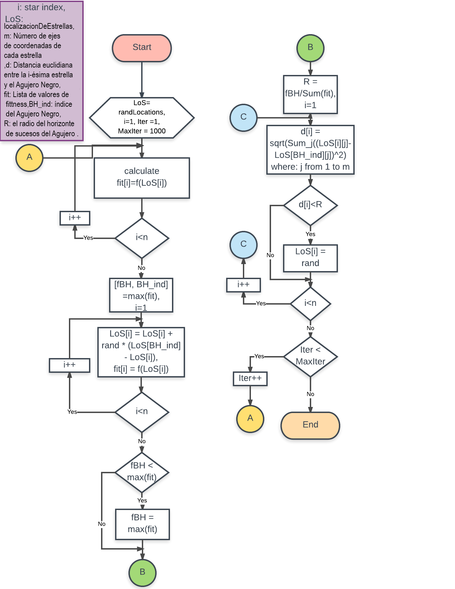

# Implementacion-algoritmica-de-hoyo-negro

### Escrito por: Fernando San Gabriel

**Agujero negro: Un nuevo enfoque de optimización heurística para la agrupación de datos**

# Pasos del algoritmo metaheurístico del agujero negro:

## 1.Inicio

•Inicializar una población de Estrellas (Soluciones Candidatas) con ubicaciones aleatorias en el espacio de búsqueda.

## 2.Búsqueda del agujero negro (Mejor solución)

**Main Loop**

### 1.Evaluación: evaluar la Función Objetivo para cada Estrella.
### 2.Selección del Agujero Negro: selecciona la Mejor Estrella que tenga el Mejor (Máximo) Valor de Aptitud como Agujero Negro.
### 3.Cambiar la ubicación de cada Estrella según esta Ecuación:

x(BH−xi(t))xi(t+1)=xi(t)+rand×i=1,2,….,N(theNumberofStars)

### 4.Si una Estrella alcanza una localización con menor coste que el Agujero Negro, intercambia sus localizaciones.
### 5.Si una Estrella cruza el Horizonte de Sucesos (R) del Agujero Negro, sustitúyela por una nueva Estrella en una ubicación aleatoria del Espacio de Búsqueda.

R=fBH∑i=1Nfi

fBSuvalordeidoneidaddelagujero.

fieselvalortestimonialdelStarith

### 6.Criterio de Terminación: Si se cumple un criterio de terminación (número máximo de iteraciones o una aptitud suficientemente buena), salir del bucle, **De lo contrario, repetir los pasos del bucle principal.**

## Los Resultados del Experimento:

### Cuando Semilla = 1:

### Función Objetivo (f1):

**MejorSolución es: 0,0012628 0,0012626 0,0012627 0,0012626 0,0012627 0,0012627 0,0012626 0,0012626 0,0012626 0,0012627**

**El mejor coste es: -1.5944e-05**

### Función Objetivo (f2):

MejorSolución es: 0,35263 0,33042 0,35099 0,35192 0,32548 0,35101 0,33843 0,30527 0,33845 0,34983

BestCost es: -918538.124

### Cuando Semilla = 2:

### Función Objetivo (f1):

MejorSolución es: 1,4672e-07 1,4672e-07 1,4672e-07 1,4672e-07 1,4672e-07 1,4672e-07 1,4672e-07 1,4672e-07 1,4672e-07 1,4672e-07 1,4672e-07 1,4672e-07

BestCost es: -2.1526e-13

### Función Objetivo (f2):

BestSolution es: 0.3372 0.28684 0.317 0.32101 0.23983 0.32667 0.31183 0.39994 0.3268 0.29392

### Cuando Semilla = 3:

### Función Objetivo (f1):

BestSolution es: 0.00085355 0.00085361 0.00085373 0.00085362 0.00085361 0.00085351 0.00085351 0.00085376 0.00085361 0.00085384

BestCost es: -7.2869e-06

### Función Objetivo (f2):

BestSolution es: 0.012472 0.012334 0.012374 0.012373 0.012242 0.012298 0.012317 0.012257 0.012412 0.012181

BestCost es: -1330.4517

### Cuando Semilla = 4:

### Función Objetivo (f1):

MejorSolución es: 0.00039626 0.00039622 0.00039621 0.00039629 0.00039631 0.0003963 0.00039628 0.00039624 0.00039628 0.00039627

BestCost es: -1.5703e-06

### Función Objetivo (f2):

BestSolution es: 0.39149 0.51041 0.4825 0.31508 0.36814 0.25724 0.53221 0.27891 0.30046 0.67877

BestCost es: -1706338.6363 

### Cuando Semilla = 5:

### Función Objetivo (f1):

MejorSolución es: 0.12744 0.12481 0.12538 0.1255 0.12581 0.12357 0.12473 0.12606 0.12513 0.12649

El mejor coste es: -0.15388

### Función Objetivo (f2):

BestSolution es: 0.23316 0.22884 0.23142 0.23138 0.22873 0.22866 0.21886 0.22705 0.22888 0.2326

BestCost es: -470000.984

## Los Resultados Finales:

1. Semilla#2 &amp; semilla#3 nos dan buenos resultados con las funciones objetivo f1 y f2 respectivamente.
2. Dado que f1 es una función de coste convexa, obtenemos muy buenos resultados. Por otro lado, f2 es una función no convexa por lo que el algoritmo lucha por encontrar el mejor coste pero casi se queda atascado en un mínimo local.

Nota: Sugiero una modificación en el algoritmo para resolver y pasar este problema.

1. En nuestros experimentos probamos 5 semillas. Como resultado de esos 5 experimentos concluyo que el Algoritmo del Agujero Negro depende un poco de la configuración inicial de las estrellas (soluciones candidatas).

## Ec.3. de [0, 1] a meramente [0, 0.3] Efecto:

Sin embargo adjunto mi sugerencia con un experimento sobre la función objetivo **f2** ya que uso seed#5 que nos han dado los peores resultados, pero ahora después del ajuste he obtenido estos resultados:

**Cuando maxIter = 100**

BestSolution es: -0.0010155 -0.0003739 3.6752e-05 5.0902e-05 -0.00026473 -0.00039566 0.0001019 0.00044734 0.00036059 0.00037904

BestCost es: -0.85456

**Cuando maxIter = 500**

MejorSolución es: 9.416e-06 9.416e-06 9.416e-06 9.416e-06 9.416e-06 9.416e-06 9.416e-06 9.416e-06 9.416e-06 9.416e-06 9.416e-06

BestCost es: **-0.00079795**

